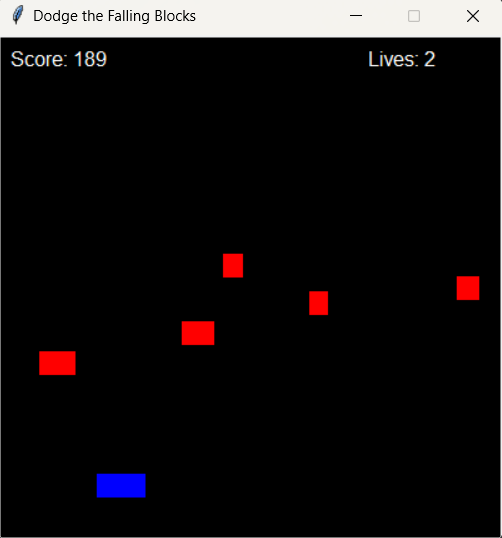

# Dodge the Falling Blocks Game

**Dodge the Falling Blocks** is an exciting and fast-paced arcade-style game built using Python and Tkinter. The goal is to avoid falling blocks while collecting power-ups that will help you survive longer. As you progress, the difficulty increases with new challenges, faster blocks, and more power-ups.

## Features
- **Power-ups**:
  - **Shield**: Grants temporary invincibility.
  - **Speed Boost**: Temporarily increases the player's speed.
  - **Score Multiplier**: Doubles your score for a limited time.
  
- **Background Music**: Background music that starts soft and becomes more intense as the game difficulty increases.

- **Multiple Stages**: New block types and challenges are introduced as the player progresses.

- **Increasing Difficulty**: The game becomes more difficult over time with faster blocks and more frequent spawns.

- **Lives**: The player has three lives to start with. The game ends when the player loses all lives.

## Gameplay
- **Objective**: Move the player character (a blue rectangle) left or right to dodge falling red blocks.
- **Controls**:
  - **Arrow keys**: Move the player left or right.
  - **Mouse**: Move the player by dragging the mouse across the screen.

## Installation
To run the game on your local machine:

### Prerequisites
1. Install Python (version 3.6 or higher).
2. Install the required libraries:
   - Tkinter (usually comes pre-installed with Python)
   - Pygame (for background music)
   
   You can install Pygame and Tkinter using pip:
   ```bash
   pip install tkinter
   pip install pygame
   ```

### Clone the Repository
```bash
git remote add origin https://github.com/NezarEa/Game-Python.git
cd dodge-the-falling-blocks
```

### Run the Game
Simply run the Python file:
```bash
python simple_game.py
```

## How It Works
- The game starts with the player character placed near the bottom of the screen.
- Blocks fall from the top of the screen, and the player must avoid them.
- Power-ups fall from the top and can be collected to gain temporary advantages.
- The difficulty increases as the player survives longer, with blocks falling faster and more frequently.

## Screenshots
  
*Example screenshot of gameplay*

## Contributing
Feel free to fork the repository and submit pull requests if you'd like to contribute to the project. Please make sure to follow the coding style used in the repository.

### Known Issues
- The game is currently in development. If you find any bugs or have suggestions for improvements, please open an issue on GitHub.

## License
This project is licensed under the MIT License - see the [LICENSE](LICENSE) file for details.

---
